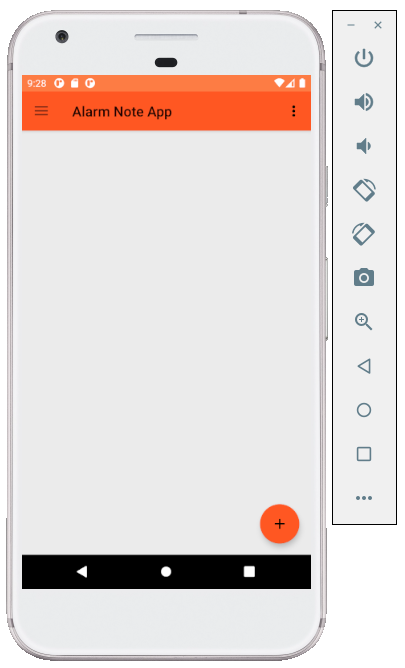
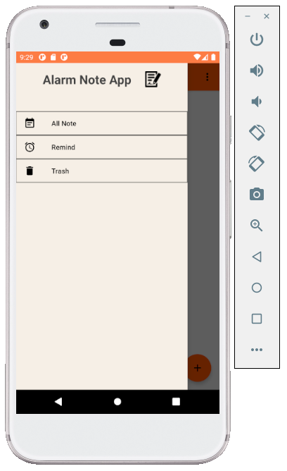
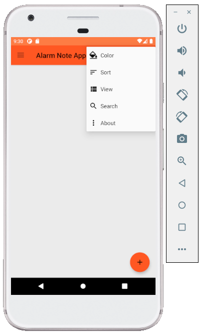

# Note App

Note App là một ứng dụng dùng để ghi chú và hẹn lịch làm việc.

Ứng dụng hiển thị danh sách những ghi chú mà người dùng đã tạo ra trước đó, những ghi chú có đặt thời gian thì khi tới giờ sẽ tự động thông báo.

Ứng dụng được viết bằng Kotlin, dễ dàng cài đặt, giao diện trực quan dễ sử dụng.

# Giao diện

## Màn hình chính và các menu

<h1></h1>

<h1></h1>

<h1></h1>

