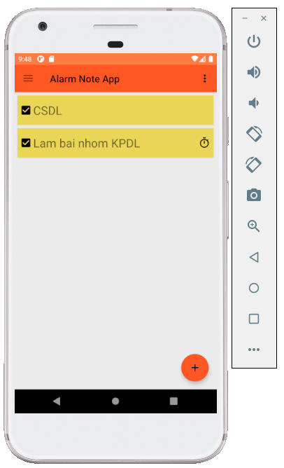

# Note App

Note App là một ứng dụng dùng để ghi chú và hẹn lịch làm việc.

Ứng dụng hiển thị danh sách những ghi chú mà người dùng đã tạo ra trước đó, những ghi chú có đặt thời gian thì khi tới giờ sẽ tự động thông báo.

Ứng dụng được viết bằng Kotlin, dễ dàng cài đặt, giao diện trực quan dễ sử dụng.

# Chức năng

## Màn hình chính và các menu

	
	
	

## Tạo note mới

Khi bấm vào nút tạo note mới (biểu tượng dấu +) thì có 2 lựa chọn text và to do.

Sau khi tạo xong thì hiển thị ra màn hình chính.

	
	
	
		

## Tạo note mới có chọn màu

Khi tạo 1 note mới ta có thể lựa chọn màu sắc hiển thị cho note đó.

	
	
			

## Chọn note theo màu 

Vào menu bên phải chọn Color, khi ta nhấn chọn màu nào thì note có màu đó sẽ được hiển thị ra màn hình.

	
	
		
			

## Sắp xếp 

Vào menu bên phải chọn Sort, khi ta chọn tiêu chí nào thì màn hình sẽ hiển thị các note được sắp xếp theo đúng tiêu chí đó.

	
	
	
	
	
			

## Hiển thị

Vào menu bên phải chọn View, ta có thể chọn cách hiển thị cho các note theo dạng List, Detail hoặc Grid.

	
	
	
	
			

## Tìm kiếm

Vào menu bên phải chọn Search, ta có thể tìm kiếm note cần tìm.

	
		

## Thông báo khi tới lịch

Khi tới lịch hẹn, app sẽ thông báo cho người dùng.

		

## Tắt thông báo

Ta có thể tắt thông báo của 1 note đã được set thông báo trước đó.

	
	
	
		

## Khóa ghi chú 

Nếu muốn người khác không thể truy cập vào những note quan trọng thì có thể lock note đó lại, khi mật khẩu được nhập đúng thì mới có quyền xem nội dung note đó.

		
		
		
		
		

## Các note có set thời gian

Vào menu bên trái chọn Remind, ta có thể xem những note có hẹn giờ.

		

## Xóa note

Ta có thể vào menu con trong từng note để xóa note đó đi.

	
	
		

## Thùng rác

Vào menu bên trái chọn Trash, ta có thể xem những note đã xóa.

Nếu muốn khôi phục lại note đã xóa thì nhấn giữ vào note và kéo sang phải, chọn yes.

Nếu muốn xóa luôn note trong thùng rác thì nhấn giữ vào note và kéo sang trái, chọn yes.

		
	
	
	
	
	
	

## Info nhóm

Vào menu bên phải chọn About sẽ hiển thị thông tin nhóm.

		

